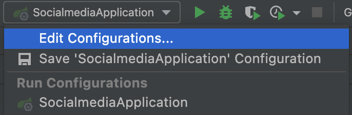
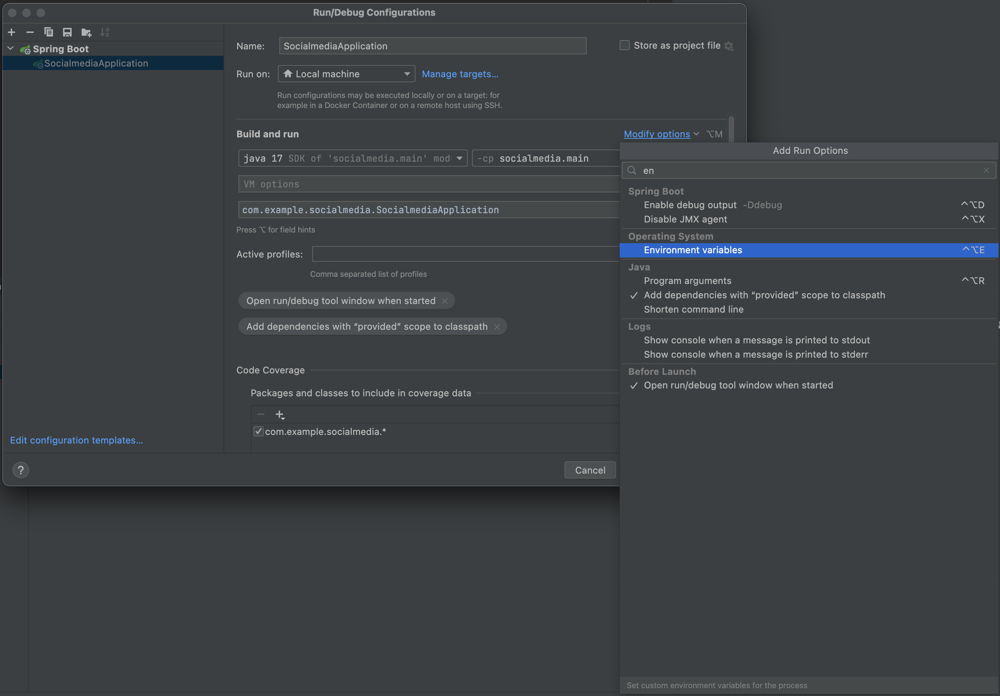
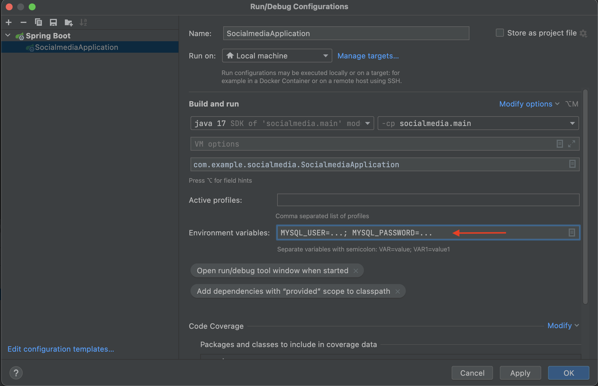

# Spring Boot 설정

## 환경변수 설정 방법

1. 우측 상단의 어플리케이션을 실행하는 부분에서 `Edit Configurations`를 찾아 클릭한다.

2. `Run/Debug Configurations` 창에서 Modify options -> Environment variables를 검색한다.

3. `{사용할 변수명}={변수 값}; ` 과 같은 형태로 세미콜론(`;`)으로 구분하여 입력한다.

